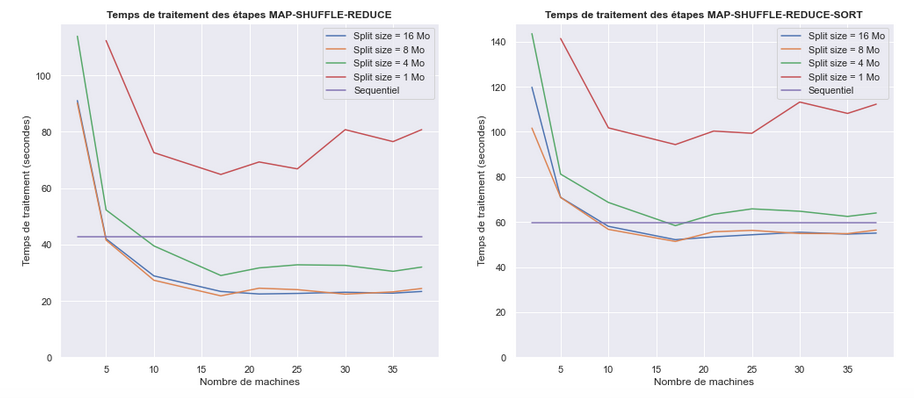

# Hadoop MapReduce from scratch
A project carried out during my Post-Master's degree at Télécom Paris (INF727). 
The objective is to implement MapReduce from scratch.
This project was suggested by Rémi Sharrock - Researcher & Associate Professor @ Telecom Paris. The details about it can be found at this address : https://remisharrock.fr/courses/simple-hadoop-mapreduce-from-scratch/.

## Version séquentielle

Utiliser le programme WordCountSeq.py, pour compter les mots d'un fichier de manière séquentielle (pas de calcul parallèle).
usage: ./wordcount.py {--count | --sort_values | --sort_values_keys} filename

## Hadoop MapReduce simpliste (calcul parallèle)

Copier une version (V1, V2, V3) du projet dans votre répertoire, ainsi que le répertoire d'input.
usage : 
* changer le nom d'utilisateur retourné dans la fonction _getname()_ du fichier ssh_connexions_utils.py
* ./MASTER.py -clean filename { | -sort}

## Synthèse des résultats

