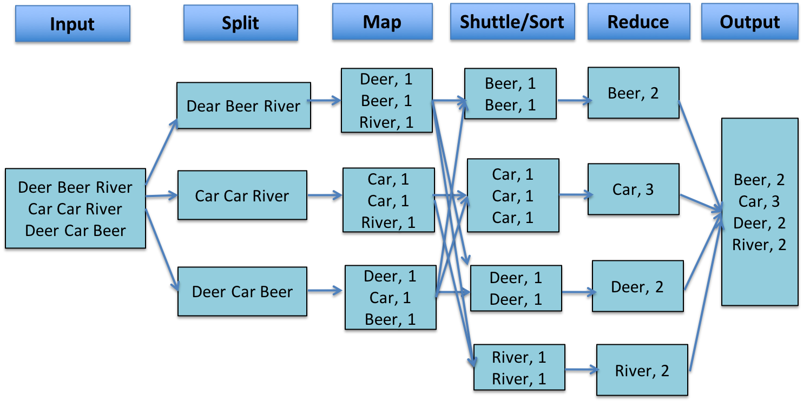
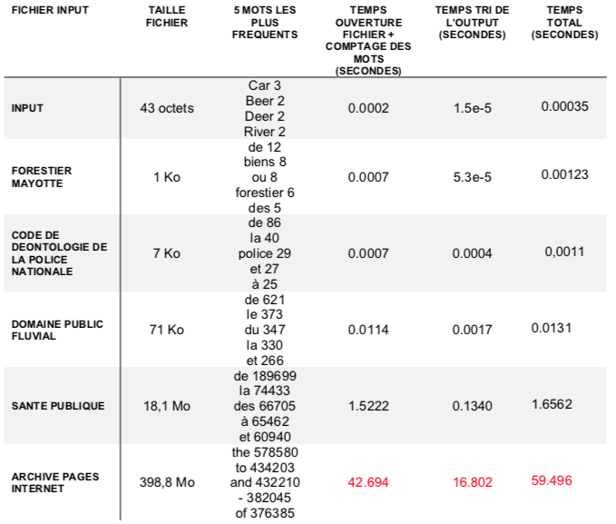
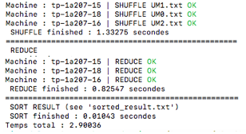
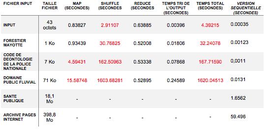
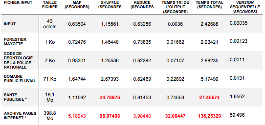
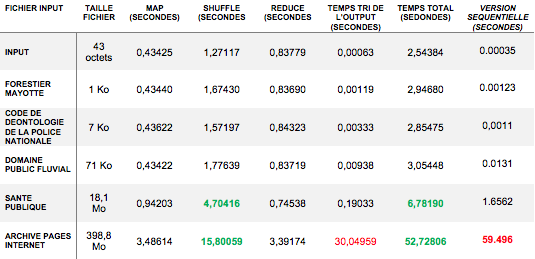

# Hadoop MapReduce from scratch

> _**Hadoop** est défini comme un ensemble de technologies distribuées, permettant de stocker et traiter de gros volumes de données. Il permet une scalabilité horizontale forte et une tolérance aux pannes_

**MapReduce** est un concept de traitement de la donnée, efficace pour des systèmes distribués en architecture.
Dans celui-ci, chaque noeud de l'ensemble du système (cluster) traite les données qu'il possède, selon trois phases principales :
* Map
* Shuffle
* Reduce

**Exemple**



> __Objectif__ : Ce projet vise à proposer une implémentation simpliste du concept MapReduce,  **from scratch**. 

Pour mesurer les bénéfices d'un tel type de modèle, nous chronométrerons une tâche simple : compter les occurences des mots dans un texte. Des fichiers texte de tailles différentes sont utilisés afin de comparer l'évolution des performances des architectures par rapport à l'input considéré.

Les architectures implémentées et évaluées sont les suivantes :
1. [Version séquentielle](#Version_séquentielle)
2. [Calculs distribués](#distributed)  
    a. [Calculs distribués V1 (naïve)](#V1)     
    b. [Calculs distribués V2 (semi-parallélisation)](#V2)  
    c. [Calculs distribués V3 (parallélisation)](#V3)  


## Version séquentielle <a id="Version_séquentielle"></a>

La solution séquentielle apporte la solution au problème de la manière la plus simple qui soit ; une fonction stockée et utilisée localement, compte le nombre d'occurences des mots dans un texte.
On différencie les calculs selon que l'utilisateur souhaite trier ou non les résultats de la requête par nombre de mots décroissants.

__Usage__
```
./WordCountSeq.py {--sort_values | --sort_values_keys} file'
```

_Détail de la fonction de calcul du nombre d'occurences des mots_
``` python
def wc(filename):
    wc_dict = {}
    with open(filename, encoding='utf8') as f:
        for line in f.readlines():
            for word in line.split():
                wc_dict[word] = wc_dict.get(word, 0) + 1
    return wc_dict
```

__Résultats__



>__Remarque :__ Passé une taille critique, les ordres de grandeurs des étapes de comptage de mots et de tri des résultats augmentent de manière significative.

## Calculs distribués <a id="distributed"></a>

__Pré-traitements__

Deux étapes de pré-traitements sont exécutées en amont des phases map, shuffle et reduce :
- __Clean__ : Nettoyage des machines du cluster 
- __Deploy__ : Déploiement des splits de données aux machines du cluster (workers)

__Traitements__

Une fois le déploiement des splits effectués, une machine _MASTER_ envoie des instances de jobs MapReduce aux différentes machines _WORKERS_, qui exécutent les phases __map__, __shuffle__ et __reduce__.
Les résultats sont renvoyés au _MASTER_ via un affichage dans la sortie standard.
À tout moment, le _MASTER_ connaît l'affectation des tâches dans le cluster de machines (association split de données-machine).
Une log utilisateur affiche en temps réel l'avancement des tâches.

_Note : La liste des machines utilisées dans le cluster est paramétrable via le fichier `machines.txt`_

__Exemple Log utilisateur__



### Calculs distribués V1 (naïve) <a id="V1"></a>

__Usage__

Cloner le répertoire `V1` du projet
```
./MASTER.py -clean <filename> {-sort}
```

__Détails d'implémentation__

- Architecture de calcul distribué 
- Aucune parallélisation de traitement au sein d'un _WORKER_
- 1 fichier _shuffle_ = 1 mot du texte initial
- _reducer_ implémenté via une structure de stockage <hash_value, [word, occurences]>

__Résultats__

_Note : Résultats pour un cluster de 4 machines_



>**Remarque :** Dans une architecture distribuée, l'étape de **shuffle** est un frein majeur à l'optimisation du traitement ! Les versions suivantes contiennent des améliorations pour le passage à l'échelle

## Calculs distribués (V2 semi-parallélisation) <a id="V2"></a>

__Usage__
Cloner le répertoire `V2` du projet
```
./MASTER.py -clean <filename> {-sort}
```

__Détails d'implémentation__

- Architecture de calcul distribué 
- Réduction du nombre de connexions SSH dans la phase de shuffle grâce à une centralisation de la création des répertoires distants (lors de la phase _deploy_)
- Réduction du nombre de connexions SHH grâce à la diminution du nombre de fichiers à transférer sur le réseau 
1 fichier _shuffle_ = 1 machine _WORKER_ 
- **parallélisation** de l'envoi des fichiers _shuffle_ au sein d'un _WORKER_
- optimisation de la phase _reduce_

__Résultats__



_Note : Résultats pour un cluster de 21 machines et une taille de split de 8Mo_

>**Remarques :** 
> * L'amélioration des temps de traitement est nette ! même si l'étape de **shuffle** reste très gourmande
> * Lorsque la taille de fichier à traiter augmente, l'écart de temps de traitement avec la version séquentielle **diminue** (17x supérieur pour le fichier `sante_publique`et 2.3x supérieur pour le fichier `archives_pages_internet`)
> * Dans la version suivante, nous allons encore plus loin dans la parallélisation des traitements

## Calculs distribués (V3 parallélisation) <a id="V3"></a>

__Usage__

```
./MASTER.py -clean <filename> {-sort}
```

__Détails d'implémentation__

- Architecture de calcul distribué 
- **parallélisation** de    
    - l'étape de **hashage** de chaque mot, afin de lui affecter sa machine destinatrice  
    - l'écriture des mots dans chaque fichier `shuffle`  
- Optimisation des fichiers `UM.txt`

    
__Résultats__



_Note : Résultats pour un cluster de 21 machines et une taille de split de 8Mo_

>**Remarque :** Le temps de traitement de la version séquentielle a été battu pour le fichier le plus volumineux ! Nous pouvons finalement étudier les différences de temps de traitement en fonction des paramétrages du cluster ; tailles de splits des données initiales et nombre de machines

## Conclusion

Dans une architecture de calcul distribué, la phase de communication entre les noeuds est la plus gourmande. Il est donc nécessaire que le jeu de données initial ait une taille minimale afin de profiter des performances de ce type d'implémentation !

__Résultats en fonction des paramétrages du cluster__


Les performances de la version séquentielle sont dépassées pour des tailles de split de 8 et 16Mo, à partir d'un cluster de 10 machines.

Si on diminue la taille de splits en dessous de 4Mo, les performances sont nettement plus faibles. C’est le reflet du goulot d’étranglement au niveau des transferts de fichiers sur le réseau.

Finalement, à partir d'un certain point, l'ajout de machines dans le cluster ne permet plus d'améliorer les performances.

>**Aller plus loin**
> - Implémenter la gestion des pannes sur le cluster 
> - Optimiser les temps de traitement par l'utilisation de stream processing


